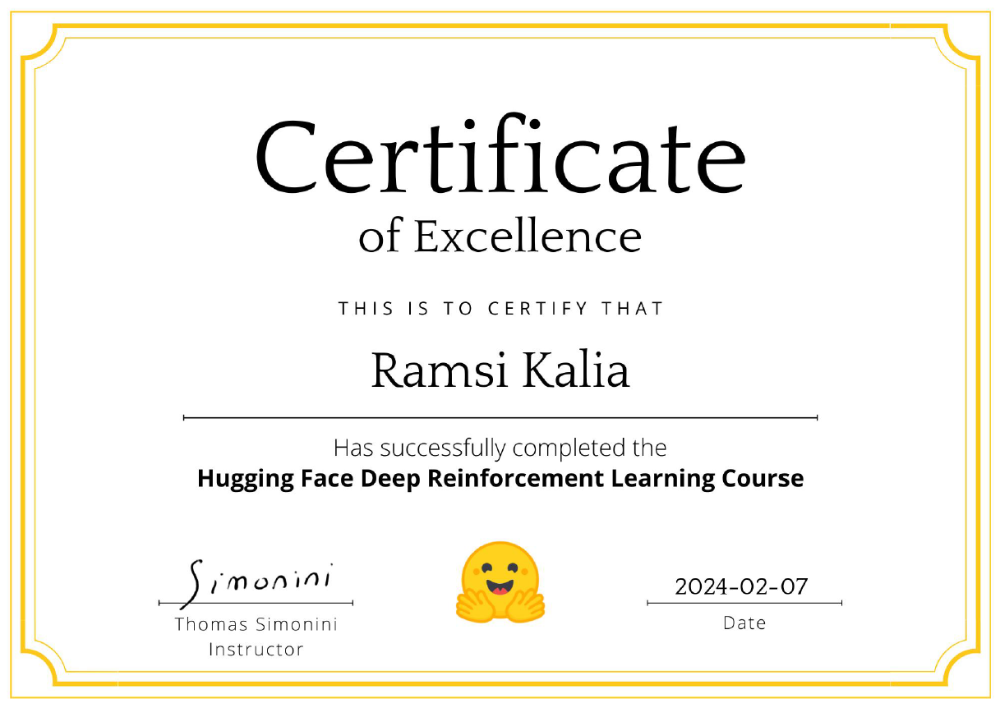

# Reinforcement Learning Repository

Welcome to my Reinforcement Learning journey!
 
 
This repository is dedicated to all things Reinforcement Learning, covering theory, practice, and applications.

## About

This repository chronicles my exploration of the dynamic field of Reinforcement Learning (RL). As I embark on this learning adventure, I'll be diligently pushing all my work here, including scripts, projects, and a plethora of resources. From videos, lectures, and blog posts to reference articles and beyond, I'll document every step of my learning process. I'm committed to following the advice from experts and leveraging diverse learning materials to enrich my understanding and skills in RL. Join me as I dive deep into the fascinating world of Reinforcement Learning!

I am following the advice from [Spinning Up as a Deep RL Researcher](https://spinningup.openai.com/en/latest/spinningup/spinningup.html#the-right-background) by Joshua Achiam summarised here.

1. The Right Background 
    * Build up a solid mathematical background 
    * Build up a general knowledge of deep learning
    * Become familiar with at least one deep learning library
    * Get comfortable with the main concepts and terminology in RL
2. Learn by Doing
    * Write your own implementations
    * Simplicity is critical. Implement the simplest algorithms first
    * Start with vanilla policy gradient (also called REINFORCE), DQN, A2C (the synchronous version of A3C), PPO (the variant with the clipped objective), and DDPG
    * Focus on understanding
    * Implement an algorithm based on a paper but don’t overfit to paper details
    * Study existing implementations for inspiration
    * Iterate fast in simple environments like CartPole-v0, InvertedPendulum-v0, FrozenLake-v0, and HalfCheetah-v2 
    * Measure everything
    * Scale experiments when things work
3. Developing a Research Project
    * Start by exploring the literature to become aware of topics in the field
    * Approaches to idea-generation 
        * Improving on an Existing Approach
        * Focusing on Unsolved Benchmarks
        * Create a New Problem Setting
    * Avoid reinventing the wheel
4. Doing Rigorous Research in RL
    * Set up fair comparisons
    * Remove stochasticity as a confounder (3 - 10 random seeds)
    * Run high-integrity experiments
    * Check each claim separately

Read the entire article linked above for more insights. 

## Resources

This section will house all the resources I accessed during this journey.

_I will endeavour to catalog all the resources I can though I may inadvertently overlook some._ 

| Resource Type | Name | 
|----------|----------|
|Books||
|| [Reinforcement Learning: An Introduction second edition](http://incompleteideas.net/book/the-book-2nd.html) by Richard S. Sutton and Andrew G. Barto|
| Courses || 
|| [Reinforcement Learning beginner to master - AI in Python](https://www.udemy.com/course/beginner-master-rl-1/) by [Escape Velocity Labs](https://www.linkedin.com/company/evlabs)| 
|| [Hugging Face's RL course](https://huggingface.co/learn/deep-rl-course/unit0/introduction)| 
|| [Foundations of Deep RL -- 6-lecture series by Pieter Abbeel](https://youtube.com/playlist?list=PLwRJQ4m4UJjNymuBM9RdmB3Z9N5-0IlY0&si=0ND0YriA9-ti3uyT)|
|| [Deep Reinforcement Learning: CS 285 Fall 2020](https://youtube.com/playlist?list=PL_iWQOsE6TfURIIhCrlt-wj9ByIVpbfGc&si=g14aK4OR1TeYhGyS) and [CS 285 at UC Berkeley website](https://rail.eecs.berkeley.edu/deeprlcourse/)|
|| [Google DeepMind x UCL RL Lecture Series 2021](https://youtube.com/playlist?list=PLqYmG7hTraZDVH599EItlEWsUOsJbAodm&si=3nkBY5lX1V-n45U-)|
|| [RL Algorithms Implementation Study Group by Costa Huang](https://youtube.com/playlist?list=PLQpKd36nzSuMynZLU2soIpNSMeXMplnKP&si=xeGJmYXqAlgwP-l0)|
|| [Rainbow is all you need!](https://github.com/Curt-Park/rainbow-is-all-you-need) - from DQN to Rainbow|
|| [PG is all you need!](https://github.com/MrSyee/pg-is-all-you-need) from A2C to SAC| 
|Libraries||
||[Gym](https://www.gymlibrary.dev/index.html) |
|| [Gymnasium](https://gymnasium.farama.org/api/spaces/)|
|| [Stable Baselines3](https://stable-baselines3.readthedocs.io/en/master/)|
|| [RL Baselines3 Zoo](https://github.com/DLR-RM/rl-baselines3-zoo)|
|| [Sample Factory](https://samplefactory.dev/) |
|| [CleanRL](https://github.com/vwxyzjn/cleanrl)|
|| [Optuna](https://optuna.org/)|
|Articles||
|| [A Map of Reinforcement Learning](https://louiskirsch.com/maps/reinforcement-learning)
| Custom Environments ||
|| [SnowballFight](https://huggingface.co/spaces/ThomasSimonini/SnowballFight)|
|| [Huggy the Doggo](https://huggingface.co/spaces/ThomasSimonini/Huggy) |
|| [VizDoom(Doom)](https://vizdoom.cs.put.edu.pl/)|
|| [PyBullet](https://pybullet.org/wordpress/)|
|Projects||
||

## Topics Explored

- Tabular methods
    - Markov decision process
    - Dynamic programming
    - Monte Carlo methods
    - Time difference methods (SARSA, Q-Learning)
    - N-step bootstrapping
- Continuous state spaces
    - State aggregation
    - Tile Coding
- Deep Reinforcement Learning
    - Deep SARSA
    - Deep Q-Learning
    - REINFORCE
    - Advantage Actor-Critic / A2C 

 

 __Methods Mind Map__

## Acknowledgments

Special thanks to the creators of the various RL courses, libraries, and environments included in this repository. Their efforts have been instrumental in advancing the field of Reinforcement Learning and making valuable resources accessible to learners worldwide.

## Connect with Me

Have questions, suggestions, or feedback? Feel free to reach out to me on [LinkedIn](https://www.linkedin.com/in/ramsikalia/). I'm always excited to engage with fellow RL enthusiasts and learners.

Happy Reinforcement Learning!

### Certifications Earned

